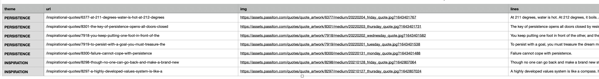

# <p align="center"> UAS Pemrograman


<br>

# Scrap Data

<p align="justify">Import Libary

- Import Request untuk mengambil data request html.

```sh
import requests
```

- from bs4 import BeautifulSoup untuk Scraping Data.

```sh
from bs4 import BeautifulSoup
```

- Import CSV untuk membuat file csv, penampung data scraping.

```sh
import csv
```

<p align="justify">Get URL

```sh
URL = "http://www.values.com/inspirational-quotes"
resp = requests.get(URL)
```

<p align="justify">Mengambil dan Append Data

```sh
for row in table.findAll('div',
                         attrs = {'class':'col-6 col-lg-3 text-center margin-30px-bottom sm-margin-30px-top'}):
    quote = {}
    quote['theme'] = row.h5.text
    quote['url'] = row.a['href']
    quote['img'] = row.img['src']
    quote['lines'] = row.img['alt'].split(" #")[0]
    quote['author'] = row.img['alt'].split(" #")[1]
    quotes.append(quote)
```

<p align="justify">Membuat file CSV dan menulis data.

```sh
filename = 'quotes.csv'
with open(filename, 'w') as f:
    w = csv.DictWriter(f,['theme','url','img','lines','author'])
    w.writeheader()
    for quote in quotes:
        w.writerow(quote)
```

---

# Hasil Output


